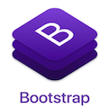

# HW5 Work Day Scheduler - Project

## Project Description

This project is intended run as a day scheduler, to help us keep track of what we have to do per day. This project will be developed using Html5, CSS3, Bootstrap and jQuery.

---

## Table of Content

1. [Project Description](https://github.com/Brondchux/hw5-work-day-scheduler#project-description)
2. [Author Info](https://github.com/Brondchux/hw5-work-day-scheduler#author-info)
3. [User Story](https://github.com/Brondchux/hw5-work-day-scheduler#user-story)
4. [Acceptance Criteria](https://github.com/Brondchux/hw5-work-day-scheduler#acceptance-criteria)
5. [Mock-Up Preview](https://github.com/Brondchux/hw5-work-day-scheduler#mock-up-preview)
6. [Useful Links](https://github.com/Brondchux/hw5-work-day-scheduler#useful-links)
7. [Tech Stack](https://github.com/Brondchux/hw5-work-day-scheduler#tech-stack)
8. [Credits](https://github.com/Brondchux/hw5-work-day-scheduler#credits)
9. [Licence](https://github.com/Brondchux/hw5-work-day-scheduler#licence)

---

## Author Info

Name: Gospel Chukwu

Email: hello@gospelchukwu.com

Portfolio: [www.gospelchukwu.com](https://gospelchukwu.com/portfolio)

---

## User Story

```md
AS AN employee with a busy schedule
I WANT to add important events to a daily planner
SO THAT I can manage my time effectively
```

---

## Acceptance Criteria

```md
GIVEN I am using a daily planner to create a schedule
WHEN I open the planner
THEN the current day is displayed at the top of the calendar
WHEN I scroll down
THEN I am presented with timeblocks for standard business hours
WHEN I view the timeblocks for that day
THEN each timeblock is color coded to indicate whether it is in the past, present, or future
WHEN I click into a timeblock
THEN I can enter an event
WHEN I click the save button for that timeblock
THEN the text for that event is saved in local storage
WHEN I refresh the page
THEN the saved events persist
```

---

## Mock-Up Preview

The following animation demonstrates the application functionality:


---

## Useful Links

1. 🗂 [Click me to view github repository for this project](https://github.com/Brondchux/hw5-work-day-scheduler/)
2. 🌍 [Click me to view deployed application on github pages](https://brondchux.github.io/hw5-work-day-scheduler/)

---

## Tech Stack





---

## Credits

Appreciations to Ben 🙌🏾 of [Columbia University Coding Bootcamp](https://bootcamp.cvn.columbia.edu/coding/landing-ftpt/?s=Google-Brand&msg_cv_scta=4&msg_cv_stbn=1&msg_cv_fcta=1&dki=Learn%20Coding&pkw=%2Bcolumbia%20%2Bcoding%20%2Bbootcamp&pcrid=471112563836&pmt=b&utm_source=google&utm_medium=cpc&utm_campaign=GGL%7CCOLUMBIA-UNIVERSITY%7CSEM%7CCODING%7C-%7COFL%7CTIER-1%7CALL%7CBRD%7CBMM%7CCore%7CBootcamp&utm_term=%2Bcolumbia%20%2Bcoding%20%2Bbootcamp&s=google&k=%2Bcolumbia%20%2Bcoding%20%2Bbootcamp&utm_adgroupid=111600049635&utm_locationphysicalms=9067609&utm_matchtype=b&utm_network=g&utm_device=c&utm_content=471112563836&utm_placement=&gclid=CjwKCAjwlrqHBhByEiwAnLmYUA8CIItksRJF6IT6XMX8WOOJBO-jtCRkzXZhI2gvsZrFEpYdRXy54RoC6jQQAvD_BwE&gclsrc=aw.ds) for being our tutor in this bootcamp.

Special thanks to [Google](https://www.google.com) for helping me find the accurate answers to my questions in a very timely manner.

---

## Licence

MIT
